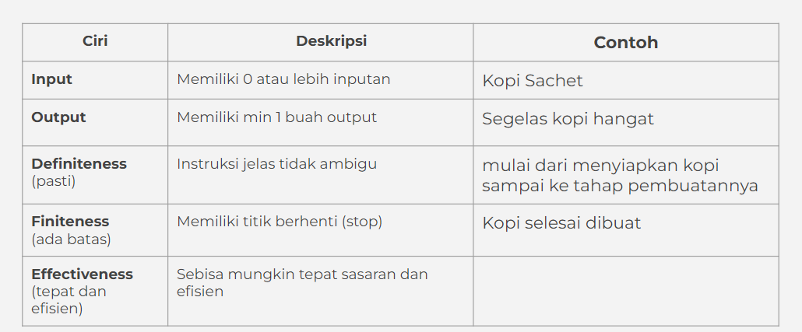

# Algoritma

Algoritma adalah urutan langkah logis tertentu untuk memecahkan suatu masalah.

Memahami algoritma sangat penting dalam belajar pemrograman. Karena bahasa pemrograman hanyalah
pemeran pendamping. Belajar algoritma akan membantu berfikir dengan struktur dan mempermudah dalam menerapkan bahasa pemrograman manapun.

## Ciri-Ciri Algortima

## Proses pada Algoritma

- Sequence -> instruksi akan dijalankan secara berurutan
- Selection -> instruksi yang dijalankan berdasarkan kondisi
- Iteration -> instruksi dijalankan berulangkali jika memenuhi suatu kondisi
- Concurrent -> instruksi dijalankan secara bersamaan

## Penyajian Algoritma

1. Deskriptif

   Penulisan algoritma dengan cara deskriptif seperti kita menulis tutorial (tata cara) dengan bahasa sehari-hari.

   Contoh:

   Menukar isi dari 2 gelas:
   Terdapat gelas A isi kopi dan gelas B isi teh
   Siapkan gelas C yg masih kosong
   Gelas A dituang ke dalam gelas C
   Gelas B dituang ke dalam gelas A
   Gelas C dituang ke dalam gelas B
   Isi gelas A dan B sudah ditukar

   Mengambil air minum:
   Pergi ke dapur
   Ambil gelas di rak
   Pergi ke dispenser
   Isi Gelas dengan air
   Jika air sudah penuh
   Air siap diminum

2. Flow chart

   Flow chart atau diagram alir, penyajian algoritmanya lebih mudah dibaca karena memiliki tampilan visual. Flow chart menggunakan simbol bangun datar sebagai representasi dari proses yg dilakukan.

   

   ### element pada flow chart

   

3. Pseudo Code

   Penulisan algoritma yg hampir menyerupai penulisan pada kode pemrograman disebut dengan pseudo code.

   Pada umumnya pseudocode memiliki 3 bagian:

   - Judul : Penjelasan dari algoritma yg dibuat
   - Deklarasi : Mendefinisikan/menyiapkan semua nama (variabel) yg akan digunakan
   - Deskripsi : langkah-langkah penyelesaian masalah

   Tidak ada aturan baku dalam penulisan pseudocode, asalkan:

   - Jelas
   - Simple
   - Konsisten
   - dan mudah dibaca org lain

   

## Contoh Algoritma dan Penyajiannya dalam 3 Bentuk

Misalkan ada algoritma sebuah Lampu lalu lintas

1. Dalam bentuk Deskriptif

   1. Terdapat lampu
   2. Apakah lampu berwarna hijau?
   3. Jika ya, jalan lalu ke no 9
   4. Apakah lampu berwarna kuning?
   5. Jika ya, hati-hati lalu ke no 9
   6. Apakah lampu berwarna merah?
   7. Jika ya, berhenti lalu ke no 9
   8. Jika tidak, lampu rusak lalu ke no 9
   9. selesai

    

2. Dalam bentuk Flow chart

   <!-- comment -->
   

     

3. Dalam bentuk Pseudocode
   <!-- comment -->
      
