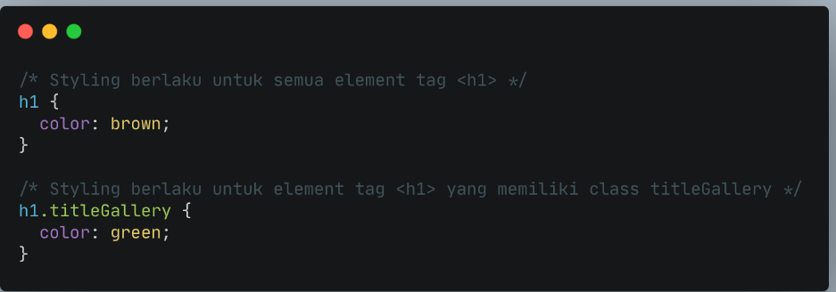
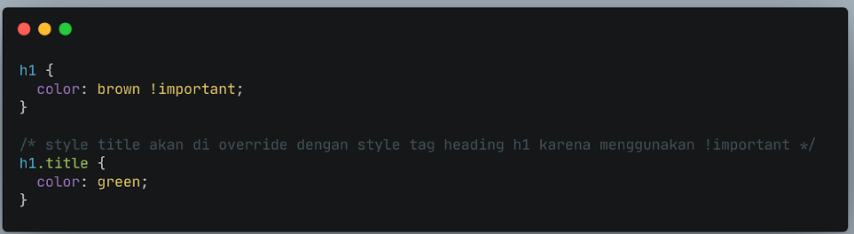

# CSS (Cascading Style Sheet)

CSS digunakan untuk menstyling HTML.

## Struktur CSS

```css
.elementHTML {
  property: "value";
}
```

## Cara Menyisipkan CSS

1. Inline Style -> menambahkan CSS pada attribute element HTML

```html
<p style="color: coral; font-size: 36px;">Ini adalah paragraf</p>
```

2. Internal CSS using <_style_><_/style_> tag

<_style_><_/style_> disisipkan pada tag <_head_>.

```html
<!DOCTYPE html>
<html lang="en">
  <head>
    <meta charset="UTF-8" />
    <meta http-equiv="X-UA-Compatible" content="IE=edge" />
    <meta name="viewport" content="width=device-width, initial-scale=1.0" />
    <title>Document</title>
    <style>
      .p {
        color: coral;
        font-size: 36px;
      }
    </style>
  </head>
  <body>
    <p>Ini adalah paragraf</p>
  </body>
</html>
```

3. External CSS -> menyisipkan link halaman CSS terpisah pada tag <_head_>

Jika kita membutuhkan banyak code pada CSS, direkomendasikan untuk memisahkan code CSS di file tersendiri (extension .css) dan terpisah dari file HTML.

```html
<head>
  <link rel="stylesheet" href="style.css" />
</head>
```

## Penulisan Selector pada CSS

Kita lihat ulang struktur CSS

```css
.elementHTML {
  property: "value";
}
```

elementHTML bersifat sebagai selector.

- Tag

contoh <_h1_>, <_div_>, <_p_> maka pada CSSnya ditulis langsung.

```css
h1 {
  property: "value";
}

div {
  property: "value";
}

p {
  property: "value";
}
```

- Class

contoh <_div class="container"_> maka pada CSSnya ditulis menggunakan _._

```css
.container {
  property: "value";
}
```

- ID

contoh: <_div class="form-element" id="password"_> maka dapat ditulis pada CSS menggunakan _#_

```css
#password {
  property: "value";
}
```

## Perbedaan atribut Class dan Id

Gunakan ID Name jika hanya ada 1 elemen pada file/halaman HTML.

Contohnya navigation dan footer.

Gunakan Class Name jika akan ada beberapa element HTML yang memiliki styling/desain yang sama.

Contoh:
Kita ingin Heading Blog kita memiliki desain yang sama.
Kita ingin setiap link memiliki styling/desain yang sama.

## Chaining Selector

Chaining selector dapat kita gunakan pada case/kasus berikut.

Jika kita memiliki 3 tag elemen HTML pada CSS namun kita ingin ada 1 elemen HTML yang memiliki styling berbeda.



## !important CSS

!important CSS berada di level paling atas dari ID dan Class.

Maksudnya adalah jika pada styling CSS kita menggunakan !important, maka styling sebelumnya baik itu ID Name atau Class Name akan di override.



## Multiple Selector

```css
h1 {
  color: brown;
  font-family: "Poppins", sans-serif;
}

p {
  font-family: "Poppins", sans-serif;
}
```

Pemakaian _font-family_ berulang pada _h1_ dan _p_. Hal ini bisa kita siasati agar terlihat lebih efisien dan tidak repetitive.

```css
h1 {
  color: brown;
}

h1,
p {
  font-family: "Poppins", sans-serif;
}
```
