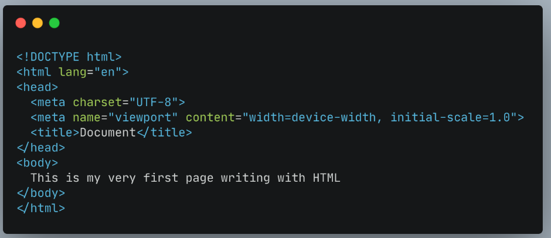
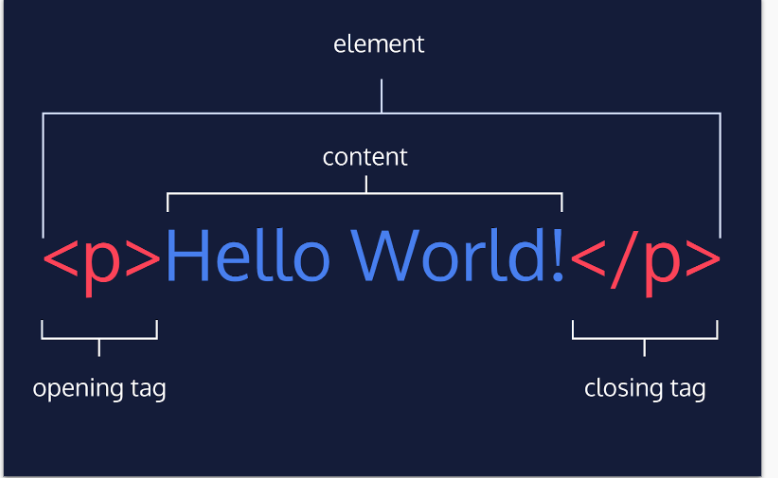
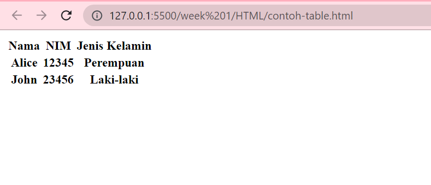
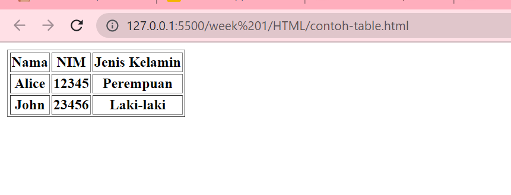
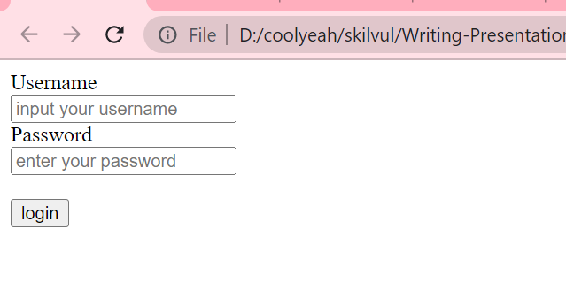

# HTML

HTML (Hypertext Markup Languange) digunakan untuk menampilkan konten pada browser.

## Cara membuat file html:

1. Buka text editor
2. buat file dengan ekstensi _.html_
   contoh: **index.html**
3. ketik ! sebagai shortcut untuk memunculkan struktur awal file html

<br>

## Dasar-Dasar HTML

- **Struktur** <br>
  
  Gambar di atas menampilkan struktur HTML.

- **Tag** <br>
  Pada contoh gambar struktur HTML di atas, kita dapat melihat ada tulisan yang diapit di dalam kurung siku. contoh: <_html_>, <_head_>, <_body_>. ketiga hal tersebut merupakan contoh dari **tag**. Untuk menuliskan code pada HTML haruslah di dalam sebuah tag.

- **HTML anatomy**
  

- **Atribut pada HTML**
  atribut adalah properti yg terdapat pada suatu element html. letaknya ada di dalam opening tag. contoh atribut adalah **class**, **id**, dll.

```html
<body>
    <h1 id="header">Ini adalah contoh header<h1>
</body>
```

**id** adalah atribut untuk tag **h1** yang memiliki nilai **header**. satu elemen dapat memiliki lebih dari satu atribut.

- **HTML comment**

cara menuliskan comment di file HTML adalah

```html
<!-- ini adalah comment pada HTML -->
<body>
    <h1 id="header">Ini adalah contoh header<h1>
</body>
```

## Membuat Table

membuat table pada html adalah dengan menggunakan tag <_table_>.

perhatikan contoh di bawah ini:

```html
<table>
  <tr>
    <th>Nama</th>
    <th>NIM</th>
    <th>Jenis Kelamin</th>
  </tr>
  <tr>
    <th>Alice</th>
    <th>12345</th>
    <th>Perempuan</th>
  </tr>
  <tr>
    <th>John</th>
    <th>23456</th>
    <th>Laki-laki</th>
  </tr>
</table>
```

maka hasilnya akan seperti ini apabila dijalankan di browser:


contoh table di atas belum memiliki border, maka untuk itu kita perlu menambahkan atribut **border** pada opening tagnya.

```html
<table border="1">
  <tr>
    <th>Nama</th>
    <th>NIM</th>
    <th>Jenis Kelamin</th>
  </tr>
  <tr>
    <th>Alice</th>
    <th>12345</th>
    <th>Perempuan</th>
  </tr>
  <tr>
    <th>John</th>
    <th>23456</th>
    <th>Laki-laki</th>
  </tr>
</table>
```

maka apabila dijalankan ulang hasilnya akan terlihat seperti ini:


## Membuat Form

membuat form pada html adalah dengan menggunakan <_form_>. perhatikan contoh berikut:

```html
<form>
  <div>
    <label for="username">Username</label> <br />
    <input type="text" id="username" placeholder="input your username" />
  </div>
  <div>
    <label for="password">Password</label> <br />
    <input type="password" id="password" placeholder="enter your password" />
  </div>
  <div>
    <br />
    <input type="submit" value="login" />
  </div>
</form>
```

hasilnya ketika dijalankan pada browser akan seperti ini:


