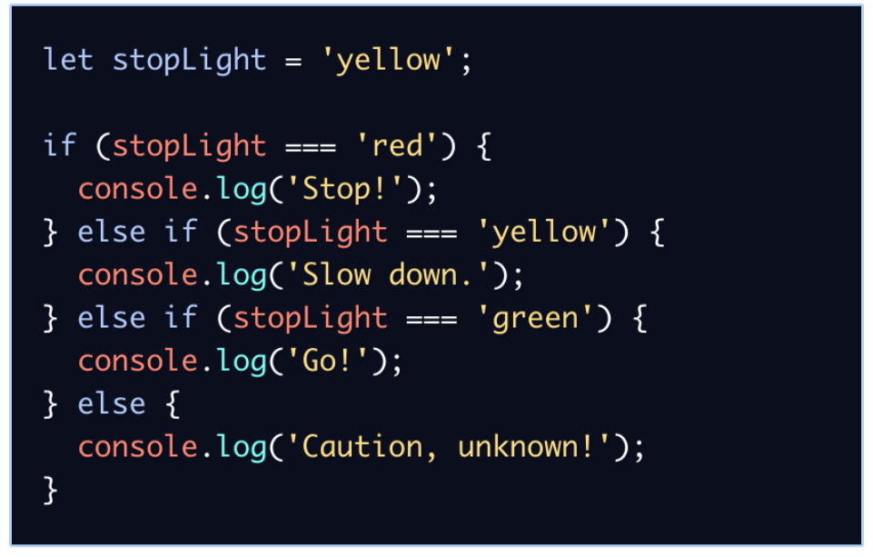

# JAVASCRIPT

Dengan Javascript dapat membuat website menjadi interaktif dan dinamis.

## Tipe Data pada JS:

- number
- string
- boolean
- null
- undefined
- object

## Cara mendefinisikan variabel pada JS

Ada 3 cara mendefinisikan sebuah variabel.

- var

```javascript
var myName = "farrah";
```

- let

```javascript
let myName = "farrah";
let myAge = 20;
```

- const (nilai tidak dapat diganti)

```javascript
const myName = "farrah";
const myAge = 20;
```

Jadi, dianjurkan untuk menggunak let untuk variabel yang dinamis/dapat diubah.

## Operator

- Arithmethic Operator

  - Tambah (+)
  - Kuramg (-)
  - Perkalian (\*)
  - Pembagian (/)
  - Modulus (%)

- Comparison Operator

  - Lebih kecil dari : <
  - Lebih besar dari: >
  - Lebih kecil atau sama dengan: <=
  - Lebih besar atau sama dengan: >=
  - Sama dengan: ===
  - Tidak sama dengan: !==

- Logical Operator
  - AND operator : &&
  - OR operator: ||
  - NOT operator: !

## Conditional at JS

- IF ELSE

```javascript
if (condition) {
  //code
} else if (condition) {
  // code
} else {
  // code
}
```

contoh:



Selain itu terdapat statement Switch-Case untuk conditional.

## Loop at JS

1. For Loop -> digunakan jika kita tahu seberapa banyak nilai pasti untuk pengulangannya

```javascript
let angka = 1;
for (angka; angka <= 10; angka++) {
  //code
}
```

2. While loop -> digunakan jika kita tidak mengetahui jumlah pasti pengulangan.

```javascript
let angka = 1;
while (angka < 10) {
  //code
}
```

3. Do While -> digunakan jika kita ingin setidaknya menjalankan pengulangan 1 kali sebelum dilakukan pengecekan kondisi

```javascript
do {
  //code
} while (conditional);
```
