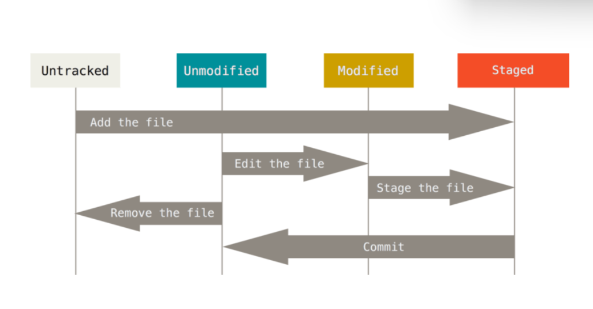

# GIT & GITHUB DASAR

GIT vs GITHUB

GIT -> software (version control system)
GITHUB -> tempat untuk mengupload code

GIT dan GITHUB digunakan para programmer utk menyimpan file pemrograman mereka, karena file
yang disimpan pada GIT akan dicatat perubahannya dan dilacak siapa yang melakukan perubahan tsb.
Oleh karena itu, GIT dan GITHUB juga digunakan oleh para programmer utk melakukan kolaborasi.

## Setup Awal

```
git config --global user.name "farrah fahira"
git config --global user.email farrahfahira2202@gmail.com
```

Catatan: Email yang disetup **harus sama** dengan yang digunakan pada github.

## Repository

Repository adalah direktori proyek yang akan dibuat.

Cara membuat repository dengan menggunakan CMD. Pada contoh di bawah kita akan membuat sebuah repo dengan nama _proyek-01_

```
git init proyek-01
```

## GIT STATUS

3 Kondisi File pada GIT:



git status digunakan untuk melihat status pada file-file yang telah dibuat.

```
git status
```

## GIT ADD

Setelah cek status dengan ‘git status’, selanjutnya kita ubah status ‘untrackted file’ dan ‘unmodified’ menjadi modified

Gunakan git add.

```
git add .
```

## GIT COMMIT

Lakukan ‘git commit’ untuk save perubahan pada version control.

```
git commit -m "first commit"
```

_"first commit"_ adalah pesan yang ditulis pada saat commit.

## GIT PUSH

```
git push
```
