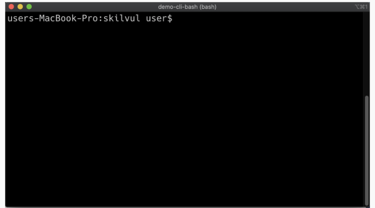
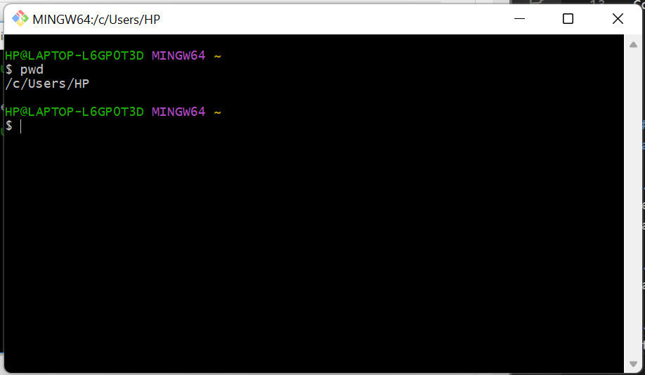
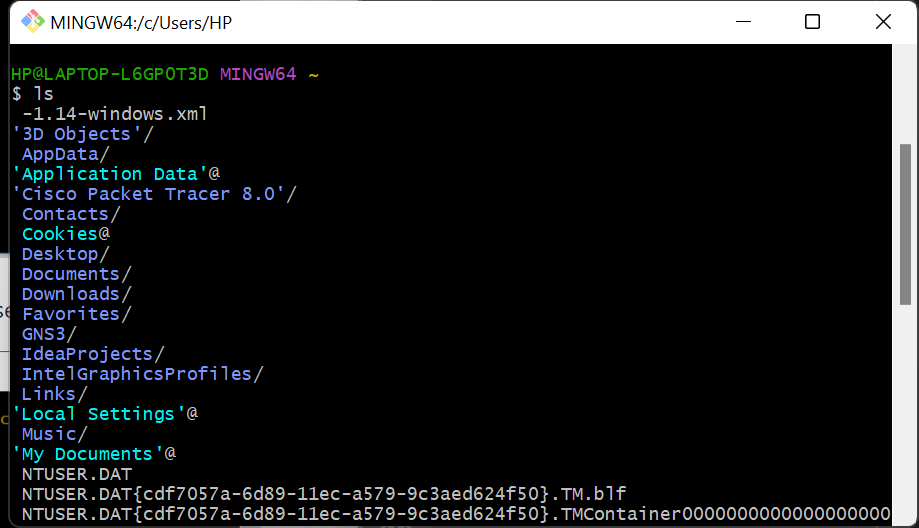
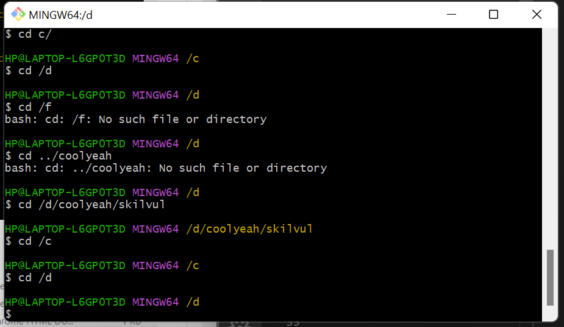

# Unix Command Line

aplikasi secara interface (tampilan) terdapat 2 jenis, yaitu

- GUI
- CLI (command line interface)

CLI adalah jenis shell yg berbasis teks, di mana **shell** sendiri adalah **program yang digunakan untuk berkomunikasi atau memerintahkan sistem**.

 

Contoh CLI:

- sh
- bash
- zsh
- cmd.exe

## syntax untuk navigasi pada CLI

1. pwd -> melihat skrg sedang berada di folder mana

 

2. ls -> melihat isi dari sebuah folder

 

3. cd < direktori > -> utk berpindah folder

 

 

## syntax untuk membuat folder/file

1. touch -> membuat file
2. mkdir -> membuat folder
3. cp -> copy file/folder
4. mv -> pindahin file/folder. bisa jg utk rename
5. rm -> hapus file/folder
6. head, tail, cat -> lihat isi file di awal, akhir, dan keseluruhan
