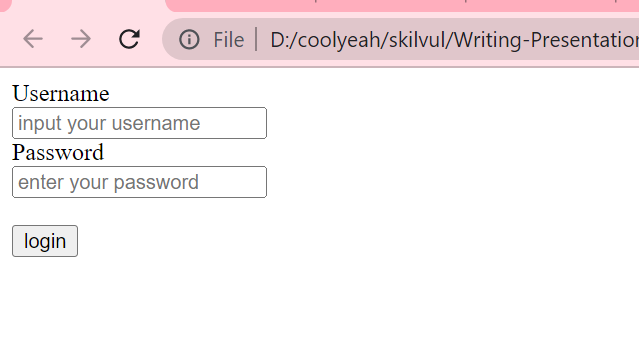
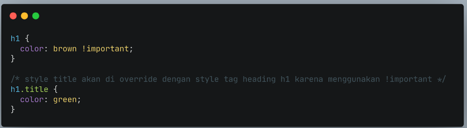
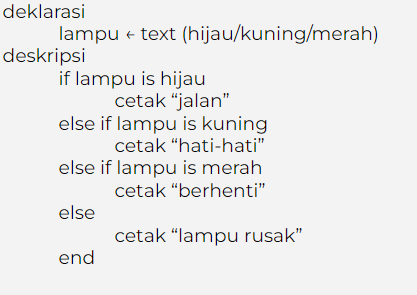

# Unix Command Line

aplikasi secara interface (tampilan) terdapat 2 jenis, yaitu

- GUI
- CLI (command line interface)

CLI adalah jenis shell yg berbasis teks, di mana **shell** sendiri adalah **program yang digunakan untuk berkomunikasi atau memerintahkan sistem**.

<br>


Contoh CLI:

- sh
- bash
- zsh
- cmd.exe

## syntax untuk navigasi pada CLI

1. pwd -> melihat skrg sedang berada di folder mana

<br>


2. ls -> melihat isi dari sebuah folder

<br>


3. cd < direktori > -> utk berpindah folder

<br>


<br>

## syntax untuk membuat folder/file

1. touch -> membuat file
2. mkdir -> membuat folder
3. cp -> copy file/folder
4. mv -> pindahin file/folder. bisa jg utk rename
5. rm -> hapus file/folder
6. head, tail, cat -> lihat isi file di awal, akhir, dan keseluruhan

# GIT & GITHUB DASAR

GIT vs GITHUB

GIT -> software (version control system)
GITHUB -> tempat untuk mengupload code

GIT dan GITHUB digunakan para programmer utk menyimpan file pemrograman mereka, karena file
yang disimpan pada GIT akan dicatat perubahannya dan dilacak siapa yang melakukan perubahan tsb.
Oleh karena itu, GIT dan GITHUB juga digunakan oleh para programmer utk melakukan kolaborasi.

## Setup Awal

```
git config --global user.name "farrah fahira"
git config --global user.email farrahfahira2202@gmail.com
```

Catatan: Email yang disetup **harus sama** dengan yang digunakan pada github.

## Repository

Repository adalah direktori proyek yang akan dibuat.

Cara membuat repository dengan menggunakan CMD. Pada contoh di bawah kita akan membuat sebuah repo dengan nama _proyek-01_

```
git init proyek-01
```

## GIT STATUS

3 Kondisi File pada GIT:


git status digunakan untuk melihat status pada file-file yang telah dibuat.

```
git status
```

## GIT ADD

Setelah cek status dengan ‘git status’, selanjutnya kita ubah status ‘untrackted file’ dan ‘unmodified’ menjadi modified

Gunakan git add.

```
git add .
```

## GIT COMMIT

Lakukan ‘git commit’ untuk save perubahan pada version control.

```
git commit -m "first commit"
```

_"first commit"_ adalah pesan yang ditulis pada saat commit.

## GIT PUSH

```
git push
```

# HTML

HTML (Hypertext Markup Languange) digunakan untuk menampilkan konten pada browser.

## Cara membuat file html:

1. Buka text editor
2. buat file dengan ekstensi _.html_
   contoh: **index.html**
3. ketik ! sebagai shortcut untuk memunculkan struktur awal file html

<br>

## Dasar-Dasar HTML

- **Struktur** <br>
  
  Gambar di atas menampilkan struktur HTML.

- **Tag** <br>
  Pada contoh gambar struktur HTML di atas, kita dapat melihat ada tulisan yang diapit di dalam kurung siku. contoh: <_html_>, <_head_>, <_body_>. ketiga hal tersebut merupakan contoh dari **tag**. Untuk menuliskan code pada HTML haruslah di dalam sebuah tag.

- **HTML anatomy**
  

- **Atribut pada HTML**
  atribut adalah properti yg terdapat pada suatu element html. letaknya ada di dalam opening tag. contoh atribut adalah **class**, **id**, dll.

```html
<body>
    <h1 id="header">Ini adalah contoh header<h1>
</body>
```

**id** adalah atribut untuk tag **h1** yang memiliki nilai **header**. satu elemen dapat memiliki lebih dari satu atribut.

- **HTML comment**

cara menuliskan comment di file HTML adalah

```html
<!-- ini adalah comment pada HTML -->
<body>
    <h1 id="header">Ini adalah contoh header<h1>
</body>
```

## Membuat Table

membuat table pada html adalah dengan menggunakan tag <_table_>.

perhatikan contoh di bawah ini:

```html
<table>
  <tr>
    <th>Nama</th>
    <th>NIM</th>
    <th>Jenis Kelamin</th>
  </tr>
  <tr>
    <th>Alice</th>
    <th>12345</th>
    <th>Perempuan</th>
  </tr>
  <tr>
    <th>John</th>
    <th>23456</th>
    <th>Laki-laki</th>
  </tr>
</table>
```

maka hasilnya akan seperti ini apabila dijalankan di browser:


contoh table di atas belum memiliki border, maka untuk itu kita perlu menambahkan atribut **border** pada opening tagnya.

```html
<table border="1">
  <tr>
    <th>Nama</th>
    <th>NIM</th>
    <th>Jenis Kelamin</th>
  </tr>
  <tr>
    <th>Alice</th>
    <th>12345</th>
    <th>Perempuan</th>
  </tr>
  <tr>
    <th>John</th>
    <th>23456</th>
    <th>Laki-laki</th>
  </tr>
</table>
```

maka apabila dijalankan ulang hasilnya akan terlihat seperti ini:


## Membuat Form

membuat form pada html adalah dengan menggunakan <_form_>. perhatikan contoh berikut:

```html
<form>
  <div>
    <label for="username">Username</label> <br />
    <input type="text" id="username" placeholder="input your username" />
  </div>
  <div>
    <label for="password">Password</label> <br />
    <input type="password" id="password" placeholder="enter your password" />
  </div>
  <div>
    <br />
    <input type="submit" value="login" />
  </div>
</form>
```

hasilnya ketika dijalankan pada browser akan seperti ini:



# CSS (Cascading Style Sheet)

CSS digunakan untuk menstyling HTML.

## Struktur CSS

```css
.elementHTML {
  property: "value";
}
```

## Cara Menyisipkan CSS

1. Inline Style -> menambahkan CSS pada attribute element HTML

```html
<p style="color: coral; font-size: 36px;">Ini adalah paragraf</p>
```

2. Internal CSS using <_style_><_/style_> tag

<_style_><_/style_> disisipkan pada tag <_head_>.

```html
<!DOCTYPE html>
<html lang="en">
  <head>
    <meta charset="UTF-8" />
    <meta http-equiv="X-UA-Compatible" content="IE=edge" />
    <meta name="viewport" content="width=device-width, initial-scale=1.0" />
    <title>Document</title>
    <style>
      .p {
        color: coral;
        font-size: 36px;
      }
    </style>
  </head>
  <body>
    <p>Ini adalah paragraf</p>
  </body>
</html>
```

3. External CSS -> menyisipkan link halaman CSS terpisah pada tag <_head_>

Jika kita membutuhkan banyak code pada CSS, direkomendasikan untuk memisahkan code CSS di file tersendiri (extension .css) dan terpisah dari file HTML.

```html
<head>
  <link rel="stylesheet" href="style.css" />
</head>
```

## Penulisan Selector pada CSS

Kita lihat ulang struktur CSS

```css
.elementHTML {
  property: "value";
}
```

elementHTML bersifat sebagai selector.

- Tag

contoh <_h1_>, <_div_>, <_p_> maka pada CSSnya ditulis langsung.

```css
h1 {
  property: "value";
}

div {
  property: "value";
}

p {
  property: "value";
}
```

- Class

contoh <_div class="container"_> maka pada CSSnya ditulis menggunakan _._

```css
.container {
  property: "value";
}
```

- ID

contoh: <_div class="form-element" id="password"_> maka dapat ditulis pada CSS menggunakan _#_

```css
#password {
  property: "value";
}
```

## Perbedaan atribut Class dan Id

Gunakan ID Name jika hanya ada 1 elemen pada file/halaman HTML.

Contohnya navigation dan footer.

Gunakan Class Name jika akan ada beberapa element HTML yang memiliki styling/desain yang sama.

Contoh:
Kita ingin Heading Blog kita memiliki desain yang sama.
Kita ingin setiap link memiliki styling/desain yang sama.

## Chaining Selector

Chaining selector dapat kita gunakan pada case/kasus berikut.

Jika kita memiliki 3 tag elemen HTML pada CSS namun kita ingin ada 1 elemen HTML yang memiliki styling berbeda.


## !important CSS

!important CSS berada di level paling atas dari ID dan Class.

Maksudnya adalah jika pada styling CSS kita menggunakan !important, maka styling sebelumnya baik itu ID Name atau Class Name akan di override.



## Multiple Selector

```css
h1 {
  color: brown;
  font-family: "Poppins", sans-serif;
}

p {
  font-family: "Poppins", sans-serif;
}
```

Pemakaian _font-family_ berulang pada _h1_ dan _p_. Hal ini bisa kita siasati agar terlihat lebih efisien dan tidak repetitive.

```css
h1 {
  color: brown;
}

h1,
p {
  font-family: "Poppins", sans-serif;
}
```

# Algoritma

Algoritma adalah urutan langkah logis tertentu untuk memecahkan suatu masalah.

Memahami algoritma sangat penting dalam belajar pemrograman. Karena bahasa pemrograman hanyalah
pemeran pendamping. Belajar algoritma akan membantu berfikir dengan struktur dan mempermudah dalam menerapkan bahasa pemrograman manapun.

## Ciri-Ciri Algortima


## Proses pada Algoritma

- Sequence -> instruksi akan dijalankan secara berurutan
- Selection -> instruksi yang dijalankan berdasarkan kondisi
- Iteration -> instruksi dijalankan berulangkali jika memenuhi suatu kondisi
- Concurrent -> instruksi dijalankan secara bersamaan

## Penyajian Algoritma

1. Deskriptif

   Penulisan algoritma dengan cara deskriptif seperti kita menulis tutorial (tata cara) dengan bahasa sehari-hari.

   Contoh:

   Menukar isi dari 2 gelas:
   Terdapat gelas A isi kopi dan gelas B isi teh
   Siapkan gelas C yg masih kosong
   Gelas A dituang ke dalam gelas C
   Gelas B dituang ke dalam gelas A
   Gelas C dituang ke dalam gelas B
   Isi gelas A dan B sudah ditukar

   Mengambil air minum:
   Pergi ke dapur
   Ambil gelas di rak
   Pergi ke dispenser
   Isi Gelas dengan air
   Jika air sudah penuh
   Air siap diminum

2. Flow chart

   Flow chart atau diagram alir, penyajian algoritmanya lebih mudah dibaca karena memiliki tampilan visual. Flow chart menggunakan simbol bangun datar sebagai representasi dari proses yg dilakukan.

   

   ### element pada flow chart

   

3. Pseudo Code

   Penulisan algoritma yg hampir menyerupai penulisan pada kode pemrograman disebut dengan pseudo code.

   Pada umumnya pseudocode memiliki 3 bagian:

   - Judul : Penjelasan dari algoritma yg dibuat
   - Deklarasi : Mendefinisikan/menyiapkan semua nama (variabel) yg akan digunakan
   - Deskripsi : langkah-langkah penyelesaian masalah

   Tidak ada aturan baku dalam penulisan pseudocode, asalkan:

   - Jelas
   - Simple
   - Konsisten
   - dan mudah dibaca org lain

   

## Contoh Algoritma dan Penyajiannya dalam 3 Bentuk

Misalkan ada algoritma sebuah Lampu lalu lintas

1. Dalam bentuk Deskriptif

   1. Terdapat lampu
   2. Apakah lampu berwarna hijau?
   3. Jika ya, jalan lalu ke no 9
   4. Apakah lampu berwarna kuning?
   5. Jika ya, hati-hati lalu ke no 9
   6. Apakah lampu berwarna merah?
   7. Jika ya, berhenti lalu ke no 9
   8. Jika tidak, lampu rusak lalu ke no 9
   9. selesai

   <br>

2. Dalam bentuk Flow chart

   <!-- comment -->
   

    <br>

3. Dalam bentuk Pseudocode
   <!-- comment -->
      

# JAVASCRIPT

Dengan Javascript dapat membuat website menjadi interaktif dan dinamis.

## Tipe Data pada JS:

- number
- string
- boolean
- null
- undefined
- object

## Cara mendefinisikan variabel pada JS

Ada 3 cara mendefinisikan sebuah variabel.

- var

```javascript
var myName = "farrah";
```

- let

```javascript
let myName = "farrah";
let myAge = 20;
```

- const (nilai tidak dapat diganti)

```javascript
const myName = "farrah";
const myAge = 20;
```

Jadi, dianjurkan untuk menggunak let untuk variabel yang dinamis/dapat diubah.

## Operator

- Arithmethic Operator

  - Tambah (+)
  - Kuramg (-)
  - Perkalian (\*)
  - Pembagian (/)
  - Modulus (%)

- Comparison Operator

  - Lebih kecil dari : <
  - Lebih besar dari: >
  - Lebih kecil atau sama dengan: <=
  - Lebih besar atau sama dengan: >=
  - Sama dengan: ===
  - Tidak sama dengan: !==

- Logical Operator
  - AND operator : &&
  - OR operator: ||
  - NOT operator: !

## Conditional at JS

- IF ELSE

```javascript
if (condition) {
  //code
} else if (condition) {
  // code
} else {
  // code
}
```

contoh:


Selain itu terdapat statement Switch-Case untuk conditional.

## Loop at JS

1. For Loop -> digunakan jika kita tahu seberapa banyak nilai pasti untuk pengulangannya

```javascript
let angka = 1;
for (angka; angka <= 10; angka++) {
  //code
}
```

2. While loop -> digunakan jika kita tidak mengetahui jumlah pasti pengulangan.

```javascript
let angka = 1;
while (angka < 10) {
  //code
}
```

3. Do While -> digunakan jika kita ingin setidaknya menjalankan pengulangan 1 kali sebelum dilakukan pengecekan kondisi

```javascript
do {
  //code
} while (conditional);
```
