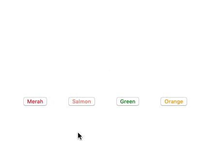
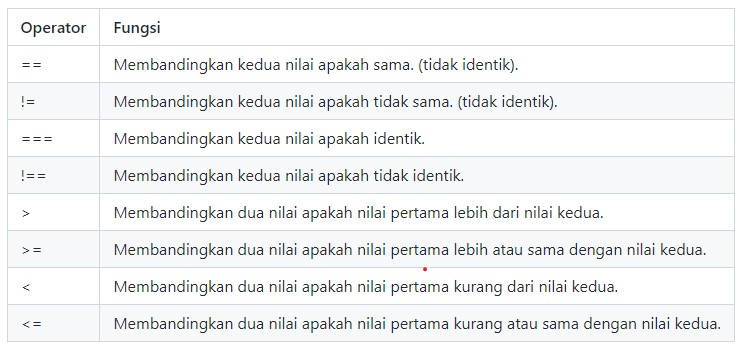

## Javascript - Scope

- ### Pengertian

  Scope adalah konsep dalam flow data variabel. Menentukan suatu variabel bisa diakses pada scope tertentu atau tidak. Analogi mudahnya kita semua bisa melihat bintang-bintang dilangit karena bersifat global, tetapi jika kita tinggal di Aceh kita tidak bisa melihat monas yang ada di jakarta.

- ### Blocks

  Blocks adalah code yang berada didalam curly braces {}. Conditional, function, dan looping menggunakan blocks.

- ### Global Scope

  Global scope berarti variabel yang kita buat dapat diakses dimanapun dalam suatu file. Agar menjadi Global Scope, suatu variabel harus dideklarasikan diluar Blocks.

  ```javascript
  let myName = "Justin";

  function greeting() {
    return myName; // Justin
  }

  consonle.log(myName); // Justin
  ```

- ### Local Scope

  Local scope berarti kita mendeklarasikan variabel didalam blocks seperti function, conditional, dan looping. Maka variabel hanya bisa diakses didalam blocks saja. Tidak bisa diakses diluar blocks.

  ```javascript
  function greeting() {
    let myName = "Justin";
    return myName; // Justin
  }

  consonle.log(greeting()); // Justin
  consonle.log(myName); // Uncaught ReferenceError: myName is not defined because local scope
  ```

## Javascript - Function

- ### Permasalahan

  Terkadang, saat kita membuat fitur program, kita memiliki beberapa perintah yang sama, yang selalu kita tulis berulang - ulang, sehingga baris kode yang kita miliki menjadi banyak sehingga kode yang kita buat tidak cukup efektif.

  Lalu bagaimana cara agar kita membuat program kita lebih efektif, tidak menulis perintah yang sama secara berulang - ulang ?

- ### Penjelasan

  Fungsi merupakan kumpulan perintah yang digabung menjadi satu dan bisa dipanggil secara bersamaan. Apabila ada perintah - perintah yang sama, bisa kita masukkan ke dalam fungsi, sehingga kita tidak perlu menuliskan perintah yang sama tersebut berulang kali.

  - Cara membuat fungsi
    Untuk membuat sebuah fungsi, kita dapat menggunakan kata kunci `function` dengan diikuti nama fungsinya. Berikut contoh pembuatan fungsi untuk menghitung luas persegi panjang.

    ```javascript
    // membuat fungsi untuk menghitung luas persegi panjang
    function hitungLuasPersegiPanjang() {
      var panjang = 5;
      var lebar = 6;
      var luas = panjang * lebar;
      console.log(luas);
    }

    // menjalankan fungsi
    hitungLuasPersegiPanjang(); // output : 30

    // fungsi bisa dijalankan lagi
    hitungLuasPersegiPanjang(); // output : 30
    ```

    Apabila kita menjalankan fungsi `hitungLuasPersegiPanjang` diatas, maka pada console browser akan muncul output `30` dari hasil perhitungan luas persegi panjang. Apabila kita ingin menghitung luas persegi panjang lagi, kita tinggal memanggil fungsi `hitungLuasPersegiPanjang` tersebut sekali lagi, jadi tidak perlu menuliskan script hitung luas persegi berkali - kali

  - Jenis-jenis Fungsi

    1. Menggunakan cara biasa;
       Berikut cara membuat fungsi yang paling sederhana yang sudah dicontohkan pada penjelasan diatas.
       ```javascript
       function hitungLuasPersegiPanjang() {
         var panjang = 5;
         var lebar = 6;
         var luas = panjang * lebar;
         console.log(luas);
       }
       ```
    2. Menggunakan parameter
       Pada contoh fungsi sebelumnya, kita bisa menghitung luas persegi panjang secara berulang kali, namun `panjang` dan `lebar` dari persegi panjang yang dihitung selalu sama. Agar kita dapat mengubah nilai dari `panjang` dan `lebar` pada fungsi `hitungLuasPersegiPanjang`, maka kita dapat menggunakan parameter. Kemudian, kita dapat memasukkan `panjang` dan `lebar` dari persegi panjang setiap kali kita memanggil fungsi `hitungLuasPersegiPanjang`

       ```javascript
       // membuat fungsi dengan parameter panjang dan lebar
       function hitungLuasPersegiPanjang(panjang, lebar) {
         var luas = panjang * lebar;
         console.log(luas);
       }

       // menjalankan fungsi dengan memasukkan nilai parameter
       hitungLuasPersegiPanjang(5, 6); // output : 30
       hitungLuasPersegiPanjang(2, 4); // output : 8
       hitungLuasPersegiPanjang(3, 5); // output : 15
       ```

    3. Menggunakan return
       Agar nilai dari perhitungan luas persegi panjang dapat diolah kembali, kita dapat mengembalikan nilai dari fungsi `hitungLuasPersegiPanjang` menggunakan perintah `return`

       ```javascript
       // index.js

       // membuat fungsi yang mengembalikan nilai dari luas
       function hitungLuasPersegiPanjang(panjang, lebar) {
         var luas = panjang * lebar;
         return luas;
       }

       var hasil = hitungLuasPersegiPanjang(5, 6) + 20;
       console.log(hasil); // output : 50
       ```

- ### Contoh Kasus

  - Membuat file index.html
    Pertama-tama, buatlah file `index.html` dan isi file html tersebut dengan kode di bawah ini.

    ```html
    <!-- index html -->

    <!DOCTYPE html>
    <html lang="en">
      <head>
        <meta charset="UTF-8" />
        <title>Function</title>
        <link rel="stylesheet" href="style.css" />
        <!-- menghubungkan ke file style.css -->
      </head>
      <body>
        <div id="kotak"></div>
        <button class="merah" onclick="berubah('red')">Merah</button>
        <button class="salmon" onclick="berubah('salmon')">Salmon</button>
        <button class="hijau" onclick="berubah('greenyellow')">Green</button>
        <button class="orange" onclick="berubah('orange')">Orange</button>
      </body>
      <script src="script.js"></script>
      <!-- menghubungkan dengan file script.js -->
    </html>
    ```

  - Membuat file style.css
    Buatlah file `style.css` yang nantinya akan digunakan untuk menerapkan text formatting pada index.html. Kemudian, terapkan kode di bawah ini untuk mengubah style pada div yang memiliki id `kotak`. ubah juga style button nya.

    ```css
    /* style.css */

    #kotak {
      width: 100px;
      height: 100px;
      position: relative;
      background: transparent;
      margin: 50px 50px 50px 150px;
    }

    button {
      margin-left: 40px;
      transition-duration: 0.4s;
    }

    .merah {
      color: red;
    }
    .salmon {
      color: salmon;
    }
    .hijau {
      color: green;
    }
    .orange {
      color: orange;
    }
    ```

  - Membuat file javascript
    Buatlah file `script.js` yang nantinya akan digunakan untuk menerapkan fungsi yang akan mengubah warna dari setiap kotak ketika button di klik.

    ```javascript
    // script.js

    function berubah(warna) {
      document.getElementById("kotak").style.background = warna;
    }
    ```

    hingga hasilnya menjadi:
    

## Tipe Data

    Nilai yang kita tetapkan pada variabel pasti memiliki tipe data. Tipe data merupakan pengklasifikasian data berdasarkan jenisnya. Pada JavaScript terdapat beberapa tipe data sebagai berikut:

- Undefined<br>
  Tipe data ini terbentuk ketika sebuah variabel tidak memiliki nilai. Artinya, ketika kita mendeklarasikan variabel tanpa menginisialisasikan nilainya, variabel tersebut menjadi undefined.

  ```js
  let x;
  console.log(typeof x);
  ```

  | Output|

  ***

  Undefined

  Pada contoh kode di atas, kita mendeklarasikan variabel x, tetapi kita tidak menginisialisasikan dengan nilai apa pun. Ketika kita memastikan tipe data dengan menggunakan fungsi typeof(), ia akan menghasilkan output undefined. Fungsi typeof() digunakan untuk memastikan tipe data pada variabel dengan mengembalikan tipe data tersebut dalam bentuk teks.

- Numbers<br>
  Nilai dari tipe data number adalah angka. Variabel bertipe data number dituliskan seperti angka pada umumnya:

  ```js
  let a = 12;
  let b = 9;
  console.log(a + b);
  console.log(a - b);
  console.log(a * b);
  console.log(a / b);
  console.log(a % b);
  ```

  | Output|

  ***

  21
  3
  108
  1.3333333333333333
  3

- BigInt<br>
  Pada JavaScript, tipe data “Number” hanya mencakup nilai dari -(253 - 1) hingga (253 - 1). Untuk kebutuhan umum, sebenarnya nilai tersebut sudah sangat cukup. Namun, akan ada kebutuhan tertentu di mana kita membutuhkan cakupan nilai yang lebih besar, seperti untuk kriptografi atau menentukan waktu hingga presisi microsecond. Untuk nilai di luar Number, kita bisa menggunakan tipe BigInt. Untuk membedakan tipe BigInt dan Number, tambahkan karakter n di akhir angka. Contohnya adalah seperti kode di bawah ini. Bandingkan dengan yang bertipe Number.

  ```js
  const bigNumber = 1234567890123456789012345678901234567890n;
  const myInt = 1234567890123456789012345678901234567890;

  console.log(bigNumber);
  console.log(myInt);
  ```

  | Output|

  ***

  1234567890123456789012345678901234567890n
  1.2345678901234568e+39

  Kita juga bisa menggunakan BigInt untuk operasi aritmatika pada umumnya. Yang membedakan adalah pada operasi pembagian, hasilnya akan dibulatkan ke bawah dan tanpa mengandung nilai desimal. Contohnya adalah seperti ini:

  ```js
  console.log(5n + 2n);
  console.log(5n - 2n);
  console.log(5n * 2n);
  console.log(5n / 2n);
  console.log(5n % 2n);
  ```

  | Output|

  ***

  7n
  3n
  10n
  2n
  1n

- Strings<br>
  Tipe data selanjutnya adalah string yang merupakan sebuah teks. Untuk menetapkan nilai sebagai string pada variabel gunakan tanda petik satu (‘) atau petik dua (“) di antara teksnya. Contohnya:

  ```js
  let greet = "Hello";
  console.log(typeof greet);
  ```

  | Output|

  ***

  string

  Tidak ada perbedaan antara menggunakan petik satu atau petik dua. Anda dapat menggunakan tanda petik secara bergantian, khususnya jika Anda memiliki teks yang mengandung tanda petik.

  ```js
  const question = '"What do you think of JavaScript?" I asked';
  console.log(question);
  ```

  | Output|

  ***

  "What do you think of JavaScript?" I asked

  Lalu bagaimana jika teks memiliki kedua tanda petik seperti ini?

  ```js
  const answer = '"I think it's awesome!" he answered confidently';
  console.log(answer);
  ```

  | Output|

  ***

  /home/glot/main.js:1
  const answer = '"I think it's awesome!" he answered confidently';
  SyntaxError: Unexpected identifier
  at wrapSafe (internal/modules/cjs/loader.js:979:16)
  at Module.\_compile (internal/modules/cjs/loader.js:1027:27)
  at Object.Module.\_extensions..js (internal/modules/cjs/loader.js:1092:10)
  at Module.load (internal/modules/cjs/loader.js:928:32)
  at Function.Module.\_load (internal/modules/cjs/loader.js:769:14)
  at Function.executeUserEntryPoint [as runMain] (internal/modules/run_main.js:72:12)
  at internal/main/run_main_module.js:17:47

  Tentunya kode di atas akan menghasilkan eror. Solusinya, gunakan backslash(\) untuk mengurangi ambiguitas dalam tanda petik. Mekanisme ini juga dikenal dengan nama escape string. Sehingga kode di atas akan menjadi seperti berikut:

  ```js
  const answer = '"I think it\'s awesome!" he answered confidently';
  ```

  Pada String, kita juga dapat menggunakan operator plus (+). Operator tersebut berfungsi untuk menggabungkan dua teks yang terpisah menjadi satu buah teks. Contohnya seperti ini:

  ```js
  let greet = "Hello";
  let moreGreet = greet + greet;
  console.log(moreGreet);
  ```

  | Output|

  ***

  HelloHello

  String concatenation seperti di atas akan menggabungkan string apa adanya, sehingga jika Anda ingin menggabungkan dua kata atau lebih perlu menambahkan spasi sendiri. Selain concatenation, string pada JavaScript juga mendukung string interpolation. Sederhananya, kita bisa memasukkan variabel ke dalam sebuah string template. Contohnya adalah seperti berikut:

  ```js
  const myName = "Luke";
  console.log(`Hello, my name is ${myName}.`);
  ```

  | Output|

  ***

  Hello, my name is Luke

  Perhatikan bahwa untuk mendefinisikan string template, Anda perlu menggunakan backticks (`), biasanya terletak di keyboard di sebelah kiri tombol 1). Di dalam string letakkan variabel yang ingin dimasukkan ke dalam placeholder ${myName}.

- Boolean<br>
  Boolean hanya memiliki dua nilai, yaitu true atau false. Tipe data ini menjadi kunci utama dalam penentuan logika. Kita akan banyak menggunakannya nanti dalam materi if/else statement. Untuk menetapkan nilai boolean pada variabel, gunakan keyword true atau false seperti di bawah ini. Boolean hanya memiliki dua nilai, yaitu true atau false. Tipe data ini menjadi kunci utama dalam penentuan logika. Kita akan banyak menggunakannya nanti dalam materi if/else statement. Untuk menetapkan nilai boolean pada variabel, gunakan keyword true atau false seperti di bawah ini.

  ```js
  let x = true;
  let y = false;
  console.log(typeof x);
  console.log(typeof y);
  ```

  | Output|

  ***

  boolean
  boolean

  Kita juga bisa menggunakan operator komparasi seperti lebih dari (>) atau kurang dari (<). Contohnya:

  ```js
  const a = 10;
  const b = 12;

  let isGreater = a > b;
  let isLess = a < b;

  console.log(isGreater);
  console.log(isLess);
  ```

  | Output|

  ***

  false
  true

- Null<br>
  Tipe berikutnya adalah null. Serupa dengan undefined, namun null perlu diinisialisasikan pada variabel. Null biasa digunakan sebagai nilai sementara pada variabel, tapi sebenarnya nilai tersebut “tidak ada”. Terkadang kita perlu membuat sebuah variabel, namun kita belum memerlukan nilai apa-apa dan tidak ingin terikat oleh tipe data apa pun. Nah, daripada kita tidak menetapkan nilai apa pun (variabel akan undefined) sebaiknya kita beri nilai null pada variabel tersebut dan ubah nanti ketika kita membutuhkannya. Untuk menetapkan null pada variabel, kita dapat gunakan keyword null ketika variabel tersebut diinisialisasi.

  ```js
  let someLaterData = null;
  console.log(someLaterData);
  ```

  | Output|

  ***

  null

- Symbol<br>
  Symbol adalah tipe data baru yang dikenalkan pada ES6. Tipe data Symbol digunakan untuk menunjukkan identifier yang unik. Ketika membuat Symbol, kita bisa memberikan deskripsi atau nama symbol seperti ini:

  ```js
  const id = Symbol("id");
  console.log(id);
  ```

  | Output|

  ***

  Symbol(id)

  Symbol disebut sebagai identifier yang unik karena meskipun kita membuat dua variabel symbol dengan nama atau deskripsi yang sama, kedua nilainya tetap dianggap berbeda. Contohnya lihat kode berikut:

  ```js
  const id1 = Symbol("id");
  const id2 = Symbol("id");
  console.log(id1 == id2);
  ```

  | Output|

  ***

  false

  Symbol ini umumnya digunakan sebagai nama property dari Object. Object sendiri merupakan tipe data kompleks untuk menyimpan berbagai struktur data. Kita akan segera bertemu dan mempelajari tentang object pada modul Data Structur.

- Operator<br>
  Operator dalam bahasa pemrograman sendiri adalah simbol yang memberi tahu interpreter untuk melakukan operasi seperti matematika, relasional, atau logika untuk memberikan hasil tertentu.

  - Assignment Operator<br>
    Dari contoh kode yang kita gunakan sebelumnya, sebenarnya kita sudah menggunakan assignment operator. Operator ini digunakan untuk memberikan nilai pada variabel. Pada dasarnya operator ini adalah tanda sama dengan (=), di mana tanda ini digunakan untuk menginisialisasi nilai pada variabel. Tempatkan variabel yang ingin diberi nilai di sebelah kiri, sementara nilainya di sebelah kanan. Di antara keduanya terdapat operator assignment.

    ```js
    x = y;
    ```

    Expression di atas berarti kita menginisialisasikan nilai y pada variabel x, sehingga nilai x sekarang memiliki nilai yang sama dengan y. Ada beberapa assignment operator tambahan lain dalam menginisialisasikan nilai pada variabel. Kita bisa menyebutnya sebagai shortcut dalam menentukan nilai. Contohnya:

    ```js
    let x = 10;
    let y = 5;

    x += y;

    console.log(x);
    ```

    | Output|

    ***

    15

    Pada contoh kode di atas, terdapat expression x += y; Apa artinya? Assignment operator tersebut digunakan sebagai shortcut dari x = x + y. Cara ini juga dapat digunakan pada operator aritmatika lain seperti, perkalian, pengurangan, pembagian, dan lainnya.

    ```js
    let x = 10;
    let y = 5;

    x += y; // artinya -> x = x + y;
    x -= y; // artinya -> x = x - y;
    x *= y; // artinya -> x = x * y;
    x /= y; // artinya -> x = x / y;
    x %= y; // artinya -> x = x % y;
    ```

  - Comparison Operator<br>
    Sekarang kita sudah mengetahui bagaimana cara menyimpan nilai pada sebuah variabel. Nah, selanjutnya kita akan belajar mengenai operator komparasi sebagai logika dasar dalam membandingkan nilai pada JavaScript. Terdapat serangkaian karakter khusus yang disebut dengan operator pembanding/komparasi yang dapat mengevaluasi dan membandingkan dua nilai. Berikut daftar operator dan fungsinya:
    

    Ketika kita melakukan perbandingan antara dua nilai, JavaScript akan mengevaluasi kedua nilai tersebut dan mengembalikan boolean dengan nilai hasil perbandingan tersebut, baik false atau true. Berikut contohnya:

    ```js
    let a = 10;
    let b = 12;

    console.log(a < b);
    console.log(a > b);
    ```

    | Output|

    ***

    true
    false

  - Logical Operator<br>
    Terdapat beberapa operator lain yang dapat kita gunakan untuk menetapkan logika yang lebih kompleks, yakni dengan logical operators. Dengan logical operator, kita dapat menggunakan kombinasi dari dua nilai boolean atau bahkan lebih dalam menetapkan logika. Pada JavaScript terdapat tiga buah karakter khusus yang berfungsi sebagai logical operator. Berikut macam-macam logical operator dan fungsinya:

    | Operator | Deskripsi                                                                                                |
    | -------- | -------------------------------------------------------------------------------------------------------- |
    | &&       | Operator dan (and). Logika akan menghasilkan nilai true apabila semua kondisi terpenuhi (bernilai true). |
    | !        | Operator tidak (not). Digunakan untuk membalikkan suatu kondisi.                                         |

    Contoh penerapannya pada JavaScript:

    ```js
    let a = 10;
    let b = 12;

    /* AND operator */
    console.log(a < 15 && b > 10); // (true && true) -> true
    console.log(a > 15 && b > 10); // (false && true) -> false

    /* OR operator */
    console.log(a < 15 || b > 10); // (true || true) -> true
    console.log(a > 15 || b > 10); // (false || true) -> true

    /* NOT operator */
    console.log(!(a < 15)); // !(true) -> false
    console.log(!(a < 15 && b > 10)); // !(true && true) -> !(true) -> false
    ```

    | Output|

    ***

    true
    false
    true
    true
    false
    false

## DOM

- ### Pengertian

  Document Object Model (DOM?) adalah interface yang memungkinkan developer memanipulasi halaman web dari segi struktur, tampilan, dan kontennya.

- ### Fungsi

  Fungsi DOM adalah memanipulasi halaman website menjadi lebih dinamis dengan cara mengambil, mengubah, menambah, dan menghapus elemen HTML. DOM juga mengumpulkan data, fungsi, dan atribut milik elemen yang diakses yang kemudia digunakan untuk hal lain seperti Application Programming Interface (API).

- ### Mengambil Elemen HTML

  - ID
    Menggunakan method getElementByID(). contoh:
    ```
    var title = document.getElementByID('footer-title');
    ```
  - Class
    Menggunakan method getElementByClassName(). contoh:
    ```
    var items = document.getElementByClassName('list-items');
    ```
  - Nama Tag
    Menggunakan method getElementByTagName(). contoh:
    ```
    var listItems = document.getElementByTagName('li');
    ```
  - querySelector
    Menggunakan method querySelector. contoh:
    1. Mengambil elemen CSS dengan ID:
       ```
       var header = document.querySelector('#footer');
       ```
    2. Mengambil elemen CSS dengan class:
       ```
       var items = document.querySelector('.list-items');
       ```
    3. Mengambil elemen CSS dengan tag:
       ```
       var headings = document.querySelector('h2');
       ```
    4. Mengambil elemen CSS secara lebih spesifik:
       ```
       document.querySelector('h2.footer');
       ```
    5. Mengambil elemen CSS dengan querySelectorAll:
       ```
       var heading = document.querySelectorAll('h1.heading');
       ```

  * ### Mengubah Elemen HTML

    - Konten HTML
      Menggunakan properti innerHTML yang dapat dikombinasikan dengan methid getElementByID() atau getElementByTagName(). Contoh:

      ```
      document.getElementById(“#header”).innerHTML = “Hello World!”;
      atau
      document.getElementsByTagName("div").innerHTML = "<h2>Hello World!</h2>"
      ```

    - Style/tampilan
      Mengubah style elemen HTML maupun CSS perlu mengubah properti style terlebih dahulu.
      ```
      document.getElementById(id).style.property = new style
      ```
      Contoh:
      ```
      document.getElementsByTag(“h2”).style.borderBottom = “solid 5px #FFF”;
      ```

  * ### Menambah dan Menghapus Elemen

    - Menambah Elemen
      Menggunakan method createElement(). Contoh:

      ```
      var div = document.createElement(‘div’);
      ```

    - Menghapus Elemen
      Memakai method removeChild(). Contoh:

      ```
      var elem = document.querySelector('#footer);
      elem.parentNode.removeChild(elem);
      ```

    - Mengganti Elemen
      Membuat elemen baru seperti ini:

      ```
      var div = document.querySelector('#div');
      var newDiv = document.createElement(‘div’);
      ```

      Kemudian, waktunya mengganti elemen di atas. Caranya dengan menulis script di bawah:

      ```
      newDiv.innerHTML = "Hello World2";
      div.parentNode.replaceChild(newDiv, div);
      ```

    - Menulis Ellemen Langsung ke HTML Output Stream
      Menggabungkan HTML dan JavaScript ke dalam satu baris kode. Nah, hal ini bisa dilakukan dengan method write() seperti di bawah:
      ```
      document.write(“<h2>Hello World!</h2><p>This is an example text!</p>”);
      ```

  * ### EventListener
    - Click
    - Blur
    - Form Submission
